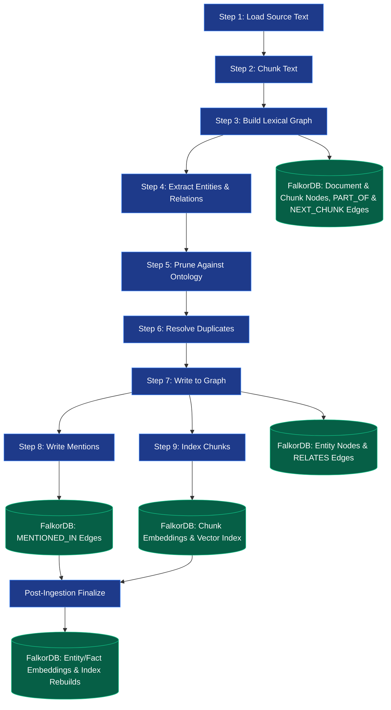

# FalkorDB GraphRAG Ingestion Pipeline: Step-by-Step Workflow

This document provides a detailed, step-by-step breakdown of how documents are ingested, chunked, processed, embedded, and saved to FalkorDB when running the ingestion pipeline in the FalkorDB GraphRAG SDK.

---

## Ingestion Pipeline Overview

The ingestion pipeline is designed as a structured, sequential workflow. The first 7 steps run in order, followed by steps 8 and 9 which run in parallel. A final **post-ingestion finalization** step syncs everything globally.

---

## Detailed Step-by-Step Breakdown

### Step 1: Load Source Text
* **What happens**: The document loader (e.g., `PdfLoader` or custom file loader) parses the source file and extracts its raw text content.
* **Embeddings generated**: None.
* **Saved to FalkorDB**: Nothing.

### Step 2: Chunk Text
* **What happens**: The raw text from Step 1 is divided into overlapping segments based on the chosen chunking strategy (e.g., `FixedSizeChunking` with a default `chunk_size` of 4000 characters and `chunk_overlap` of 500 characters).
* **Embeddings generated**: None.
* **Saved to FalkorDB**: Nothing.

### Step 3: Build Lexical Graph (Provenance Chain)
* **What happens**: To ensure **zero-loss traceability**, the pipeline constructs a sequential lexical chain of the document and its chunks. It calculates a SHA-256 hash of the full text (`content_hash`) to detect future updates.
* **Embeddings generated**: None.
* **Saved to FalkorDB**:
  * **Nodes**:
    * `(:Document {id: STRING, path: STRING, content_hash: STRING, ...})`
    * `(:Chunk {id: STRING, text: STRING, index: INTEGER, ...})`
  * **Relationships**:
    * `(:Document)-[:PART_OF {index: INTEGER}]->(:Chunk)` (connects each chunk to its parent document).
    * `(:Chunk)-[:NEXT_CHUNK]->(:Chunk)` (connects consecutive chunks to preserve reading order).

### Step 4: Extract Entities & Relationships
* **What happens**:
  * **Named Entity Recognition (NER)**: A fast local transformer model (like **GLiNER**) extracts candidate entity names from the text.
  * **LLM Validation & Relation Discovery**: The Large Language Model (e.g., `gemma4:latest` via Ollama) processes the candidate entities alongside the raw chunk text to prune incorrect extractions, extract properties/descriptions, and discover semantic relationships between entities.
  * **Quality Filtering**: Removes nodes with empty IDs or invalid formats.
* **Embeddings generated**: None.
* **Saved to FalkorDB**: Nothing.

### Step 5: Prune Against Ontology
* **What happens**: Filters out any extracted entities or relationship types that do not conform to the predefined classes, labels, property types, and connection patterns registered in the active **Ontology Graph**.
* **Embeddings generated**: None.
* **Saved to FalkorDB**: Nothing.

### Step 6: Resolve Duplicate Entities
* **What happens**: Groups duplicates using the selected resolution strategy (typically `ExactMatchResolution` which groups entities sharing the same normalized name and type label). The version with the longest description is selected as the survivor, and references/mention records for duplicate nodes are remapped to the survivor.
* **Embeddings generated**: None.
* **Saved to FalkorDB**: Nothing (changes are staged in memory).

### Step 7: Write to Graph Store (Batched)
* **What happens**: Stage-completed entities and relationships are written to the main graph database in batches (typically 500 elements at a time using Cypher `UNWIND MERGE` queries).
* **Embeddings generated**: None.
* **Saved to FalkorDB**:
  * **Nodes**:
    * `(:__Entity__ {id: STRING, name: STRING, description: STRING})` (along with concrete domain labels, e.g., `:Person`, `:Organization`).
  * **Relationships**:
    * `(:__Entity__)-[:RELATES {fact: STRING}]->(:__Entity__)` (connects entities together; note that relationship embeddings and chunk source IDs are added later during finalization).

---

## Parallel Steps (Steps 8 & 9)

Steps 8 and 9 execute concurrently to optimize ingestion throughput:

### Step 8: Write Mentions
* **What happens**: Relates the resolved entities back to the source chunks they were extracted from.
* **Embeddings generated**: None.
* **Saved to FalkorDB**:
  * **Relationships**:
    * `(:__Entity__)-[:MENTIONED_IN]->(:Chunk)` (records that a specific entity was mentioned in a specific chunk).

### Step 9: Index Chunks
* **What happens**: The text of each chunk is passed to the embedding model (e.g., `nomic-embed-text`) to generate dense semantic vector representations.
* **Embeddings generated**: Chunk text embeddings (typically 768 dimensions).
* **Saved to FalkorDB**:
  * **Nodes**: Updates the existing `(:Chunk)` nodes by writing the computed vector to the `embedding` property.
  * **Indices**: Register/updates FalkorDB's native vector index for search.

---

## Post-Ingestion Finalization (`finalize()`)

Once all files in a batch have run through the pipeline, the global `finalize()` routine is called to finalize indexes and build secondary properties:

1. **Null Cleanup & deduplication**: Cleans up orphan/empty nodes and executes global deduplication.
2. **Entity Embedding**: Generates vector embeddings for any new `__Entity__` node name properties using the embedder, saving them to `__Entity__.embedding` in FalkorDB.
3. **Relationship Embedding**:
   * Generates vector embeddings for the relationship `fact` properties.
   * Saves the vector representation directly to the `embedding` property of the `[:RELATES]` relationships.
   * Populates the `source_chunk_ids` array on the `[:RELATES]` relationship edges to track provenance.
4. **Index Rebuilding**: Triggers index builds on FalkorDB for vector and full-text search indexes to ensure retrieval is fully synchronized.
