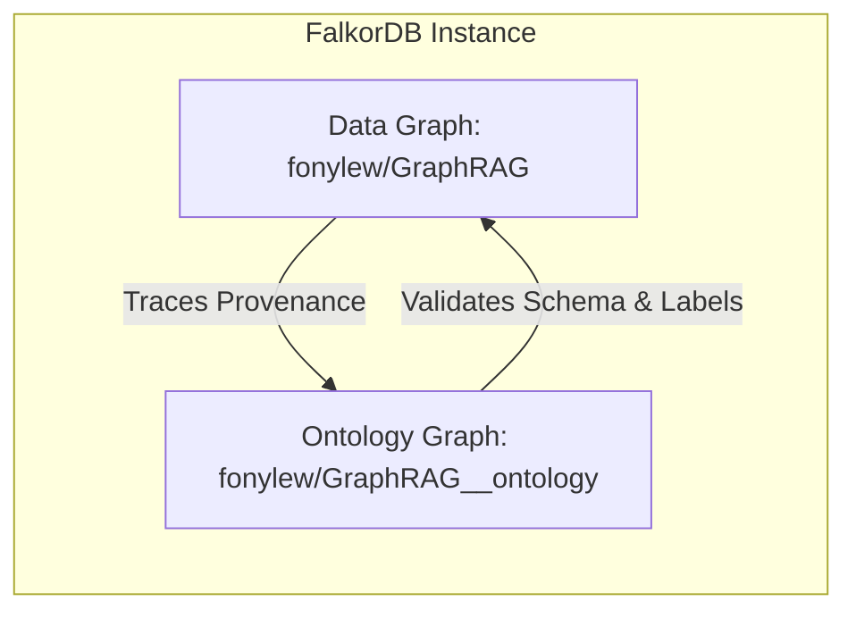
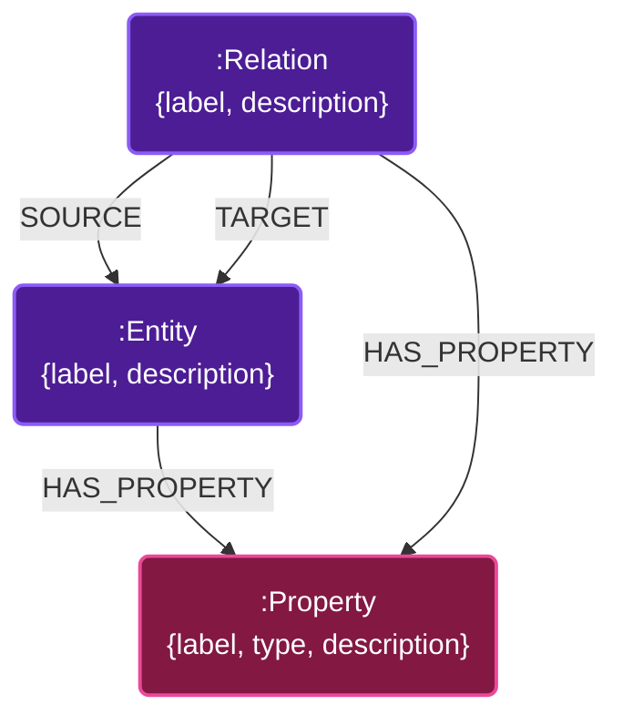

# FalkorDB GraphRAG Storage Layer Schema & Architecture

This document provides a detailed breakdown of the storage layer in the FalkorDB GraphRAG system. It describes the design of the main **Data Graph** (the Lexical-Semantic Knowledge Graph), the **Ontology Graph** (which stores the schema definitions), how relationships between different node types are modeled, and the internal storage mechanics of FalkorDB.

---

## 1. High-Level Architecture

The FalkorDB GraphRAG storage layer consists of two distinct graphs within FalkorDB:

1. **The Data Graph (e.g., `fonylew/GraphRAG`)**: Contains the ingested documents, their chunked text segments, extracted entities, and the semantic relationships between those entities.
2. **The Ontology Graph (e.g., `fonylew/GraphRAG__ontology`)**: Houses the schema definition (the "ontology") which acts as a structured contract. It enforces constraints on entity/relationship labels and property types during ingestion and guides the Text-to-Cypher generation during retrieval.



---

## 2. The Data Graph Schema

The Data Graph is a **Lexical-Semantic Knowledge Graph**. It integrates the hierarchical/sequence structure of document chunks (lexical provenance) with the semantic network of extracted entities and relations.

### Schema Diagram

```mermaid
graph TD
    classDef doc fill:#1e3a8a,stroke:#3b82f6,stroke-width:2px,color:#fff;
    classDef chunk fill:#065f46,stroke:#10b981,stroke-width:2px,color:#fff;
    classDef entity fill:#7c2d12,stroke:#f97316,stroke-width:2px,color:#fff;

    Doc(":Document<br/>{id, content_hash}"):::doc
    ChunkNode(":Chunk<br/>{id, text, index, embedding}"):::chunk
    EntityNode(":__Entity__ / :[DomainLabel]<br/>{id, name, description, embedding}"):::entity

    Doc -->|PART_OF| ChunkNode
    ChunkNode -->|NEXT_CHUNK| ChunkNode
    EntityNode -->|MENTIONED_IN| ChunkNode
    EntityNode -->|RELATES {fact, embedding, source_chunk_ids}| EntityNode
```

### Node Types & Properties

#### 1. `(:Document)`
Represents the source file ingested into the system.
* **`id`** (`STRING`): Unique identifier of the document (typically the absolute filepath or document title).
* **`content_hash`** (`STRING`): A hash of the document contents used for change detection and incremental updates.

#### 2. `(:Chunk)`
Represents a contiguous text slice extracted from the document.
* **`id`** (`STRING`): Unique chunk identifier.
* **`text`** (`STRING`): The raw text fragment.
* **`index`** (`INT`): The sequential index of the chunk relative to the document (used to reconstruct reading order).
* **`embedding`** (`vecf32`): The vector embedding of the chunk text (dimension: 768, generated via `nomic-embed-text`).

#### 3. `(:__Entity__)`
A generic label applied to all extracted entities. Every entity node also carries one or more domain-specific labels (e.g., `:Person`, `:Organization`, `:Concept`) defined by the ontology.
* **`id`** (`STRING`): Unique identifier (e.g., normalized name).
* **`name`** (`STRING`): The primary display name of the entity.
* **`description`** (`STRING`): A summarized description of the entity compiled from its mentions.
* **`embedding`** (`vecf32`): Vector embedding of the entity's name (and/or description) to support fuzzy deduplication.

### Relationship Types & Properties

#### 1. `()-[:PART_OF]->()`
* **Source**: `(:Document)`
* **Target**: `(:Chunk)`
* **Description**: Establishes parent-child provenance between the document and its constituent chunks.

#### 2. `()-[:NEXT_CHUNK]->()`
* **Source**: `(:Chunk)`
* **Target**: `(:Chunk)`
* **Description**: Connects adjacent chunks (`Chunk_i -> Chunk_{i+1}`) to maintain sequential text flow. This allows linear traversals across the lexical graph.

#### 3. `()-[:MENTIONED_IN]->()`
* **Source**: `(:__Entity__)`
* **Target**: `(:Chunk)`
* **Description**: Connects an entity to the source chunk where it was extracted. This enables zero-loss provenance and citation.

#### 4. `()-[:RELATES]->()`
* **Source**: `(:__Entity__)`
* **Target**: `(:__Entity__)`
* **Description**: Captures a semantic assertion connecting two entities.
* **Properties**:
  * **`fact`** (`STRING`): A descriptive fact summarizing the nature of the relationship.
  * **`embedding`** (`vecf32`): Semantic vector representation of the `fact` string. Used during retrieval to identify relevant facts through vector similarity search.
  * **`source_chunk_ids`** (`LIST` of `STRING`): A collection of chunk IDs that support or mention this relationship. Critical for incremental deletion.

---

## 3. The Ontology Graph Schema

The Ontology Graph lives in a separate database instance (`<data_graph_name>__ontology`). It persists the domain blueprints that define what kinds of entities and relationships are valid.

### Schema Diagram



### Node Types & Properties

#### 1. `(:Entity)`
Defines an entity class allowed in the Data Graph (e.g., `Person`, `Location`).
* **`label`** (`STRING`): The class label (matches the secondary labels in the main graph).
* **`description`** (`STRING`): Description of the entity class.

#### 2. `(:Relation)`
Defines a relationship type allowed between entities.
* **`label`** (`STRING`): The edge type (e.g., `WORKS_FOR`, `LOCATED_IN`).
* **`description`** (`STRING`): Description of the relationship type.

#### 3. `(:Property)`
Defines properties that can reside on an entity class or relationship type.
* **`label`** (`STRING`): The property key (e.g., `age`, `founded_year`).
* **`type`** (`STRING`): The data type constraint (e.g., `STRING`, `INTEGER`, `BOOLEAN`).
* **`description`** (`STRING`): Description of the property.

### Relationship Types

* **`[:HAS_PROPERTY]`**: Connects an `Entity` or `Relation` to its allowed `Property` nodes. Properties are strictly scoped; a `Property` node belongs to a single owner, preventing cross-type schema pollution.
* **`[:SOURCE]`**: Links a `Relation` node to its valid source `Entity` node (for patterned relations).
* **`[:TARGET]`**: Links a `Relation` node to its valid target `Entity` node (for patterned relations).

> [!NOTE]
> **Open vs. Patterned Relations**:
> * **Patterned Relations**: If a relation has $N$ allowed `(Source -> Target)` pairs, it is stored in the ontology graph as $N$ separate `Relation` nodes, each with its own `SOURCE` and `TARGET` edges.
> * **Open-Mode Relations**: If no source/target rules are specified, a single `Relation` node is created in the ontology graph with no `SOURCE` or `TARGET` edges.

---

## 4. Under the Hood: FalkorDB Storage Mechanics

FalkorDB is built on unique architectural principles that allow it to process GraphRAG queries at high speeds:

### 1. Matrix-Based Graph Representation (GraphBLAS)
FalkorDB stores graph structures as **Sparse Adjacency Matrices** using GraphBLAS. 
* Nodes are represented as vectors, and relationships as sparse matrices.
* Graph traversals (e.g., finding entities related to another entity, or performing 2-hop expansions) are converted into **Sparse Matrix-Matrix Multiplications**.
* This approach scales with the size of the retrieved subgraphs, executing multi-hop lookups in microseconds rather than milliseconds.

### 2. Hybrid Vector Search & Graph Queries
FalkorDB natively supports vector indices alongside traditional graph indices. The GraphRAG SDK leverages this by creating:
* A vector index on `(:Chunk {embedding})`
* A vector index on `(:__Entity__ {embedding})`
* A vector index on `(:RELATES {embedding})` (edge properties)
* A full-text search index on `Chunk.text` and `__Entity__.name` for exact matches.

This hybrid storage layout allows queries like the one below to run in a single atomic database execution step, joining semantic vector similarity with physical path traversals:
```cypher
CALL db.idx.vector.queryNodes('__Entity__', 'embedding', 5, $query_vector) 
YIELD node AS startNode, score
MATCH (startNode)-[r:RELATES]->(other:__Entity__)
RETURN startNode.name, r.fact, other.name
```

---

## 5. Ingestion Operations & Data Integrity

The storage layer enforces strict rules to maintain data integrity and avoid schema drift:

### 1. Entity Resolution & Edge Remapping
During the post-ingestion finalization (`finalize()`), duplicate entities are resolved using exact name matching and fuzzy embedding lookups. When merging a duplicate entity into a surviving entity, the `EntityDeduplicator` remaps edges using the following atomic Cypher procedures:

```cypher
// Outgoing RELATES edge remapping (unioning source_chunk_ids to prevent data loss)
MATCH (dup:__Entity__ {id: $dup_id})-[r:RELATES]->(b:__Entity__)
WHERE b.id <> $survivor_id
MERGE (s:__Entity__ {id: $survivor_id})-[nr:RELATES]->(b)
WITH r, nr, coalesce(nr.source_chunk_ids, []) AS old, coalesce(r.source_chunk_ids, []) AS contrib
SET nr += properties(r)
SET nr.source_chunk_ids = old + [c IN contrib WHERE NOT c IN old]
DELETE r;

// MENTIONED_IN edge remapping
MATCH (dup:__Entity__ {id: $dup_id})-[r:MENTIONED_IN]->(c:Chunk)
MERGE (s:__Entity__ {id: $survivor_id})-[:MENTIONED_IN]->(c)
DELETE r;
```

### 2. Strict Ontology Constraints
To prevent type contradictions that would break Text-to-Cypher routines, `OntologyStore` restricts updates:
* **No Re-Typing**: Once a property is registered (e.g., `Person.age` as an `INTEGER`), it cannot be registered as a `STRING` without dropping the graph.
* **Additive Only**: You can register new entity classes and relations, but you cannot add properties to existing ones via the standard ingestion path (this prevents data/schema mismatch on historical chunks).
