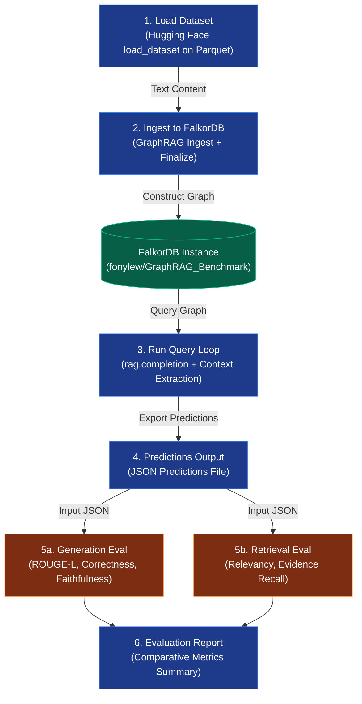

# FalkorDB GraphRAG Benchmark Integration: Implementation & Test Plan

This document details the plan to integrate the datasets and evaluation suite from the `/Users/aimet/GraphRAG-Benchmark` repository into the FalkorDB GraphRAG environment. The objective is to evaluate FalkorDB GraphRAG's query response quality, retrieval relevance, and graph indexing performance under standard benchmark conditions.

---

## 1. Benchmark Overview & Objectives

The `/Users/aimet/GraphRAG-Benchmark` repository contains two high-quality evaluation datasets:
* **Medical Subset**: Focused on clinical guidance papers, structured guidelines (e.g., NCCN guidelines), and detailed treatment paths.
* **Novel Subset**: Focused on narrative literature, tracking complex plotlines, characters, and events.

We will adapt these subsets to evaluate:
1. **Quality Metrics**: Answer Correctness, Faithfulness, Coverage, Context Relevancy, and Evidence Recall using the benchmark's built-in Ragas-based evaluation engine.
2. **Indexing Performance**: Time taken to parse, construct, and finalize the FalkorDB lexical-semantic graph for both subsets.
3. **Retrieval Latency**: Query latency distribution under active database reads.

---

## 2. Benchmark Architecture

The benchmark integration is structured as follows:



---

## 3. Data Integration Strategy

The dataset files are located at:
* **Corpus**: `/Users/aimet/GraphRAG-Benchmark/Datasets/Corpus/{medical, novel}.parquet`
* **Questions**: `/Users/aimet/GraphRAG-Benchmark/Datasets/Questions/{medical_questions, novel_questions}.parquet`

### 3.1 Corpus Ingestion
* Each record in the corpus Parquet file contains:
  * `corpus_name`: A identifier/title of the text segment.
  * `context`: The raw text contents.
* We will load this data using `datasets.load_dataset("parquet", data_files=...)`.
* We will call `rag.ingest(text=item["context"], document_id=item["corpus_name"])` for each record in the corpus.
* Once all documents are ingested, `await rag.finalize()` is executed to complete the indexing.

### 3.2 Question Answering & Context Retrieval
* The questions Parquet file contains:
  * `id`: Unique question ID.
  * `question`: The text of the question.
  * `source`: The corpus name the question relates to.
  * `answer`: Ground truth answer.
  * `evidence`: Ground truth evidence text.
  * `question_type`: E.g., Fact Retrieval, Complex Reasoning, Contextual Summarize, Creative Generation.
* For each question, we will execute:
  ```python
  response = await rag.completion(question, return_context=True)
  generated_answer = response.answer
  # Concatenate retrieved chunk contents to form context string
  retrieved_context = "\n".join([item.content for item in response.retriever_result.items])
  ```
* Output predictions are saved to `results/falkordb_graphrag/predictions_<subset>.json` with the required structure:
  ```json
  [
    {
      "id": "question_id",
      "question": "question text",
      "source": "corpus_name",
      "context": "retrieved context",
      "evidence": "ground truth evidence",
      "question_type": "type",
      "generated_answer": "generated answer",
      "ground_truth": "ground truth answer"
    }
  ]
  ```

---

## 4. Test Scenarios & Parameters

To ensure a fair comparison against other frameworks (e.g. LightRAG, Microsoft GraphRAG), the benchmark will be evaluated under the following controlled scenarios:

### SC-BENCH-001: Medical Subset Evaluation
* **Dataset**: `medical.parquet` (1,055,437 bytes), `medical_questions.parquet` (716,539 bytes).
* **Chunking**: `FixedSizeChunking(chunk_size=1200, chunk_overlap=100)` (matching the LightRAG example configuration).
* **LLM**: Local `ollama/gemma4:latest` (or API-driven if OpenAI keys are configured).
* **Embedder**: `ollama/nomic-embed-text:latest` (dimension: 768).

### SC-BENCH-002: Novel Subset Evaluation
* **Dataset**: `novel.parquet` (4,848,282 bytes), `novel_questions.parquet` (1,312,016 bytes).
* **Chunking**: `FixedSizeChunking(chunk_size=1200, chunk_overlap=100)`.
* **LLM**: Local `ollama/gemma4:latest`.
* **Embedder**: `ollama/nomic-embed-text:latest`.

---

## 5. Metrics & Success Criteria

The evaluation results will be run through the benchmark's scripts to measure:

1. **Generation Metrics (via `Evaluation.generation_eval`)**:
   * **ROUGE-L**: Measures overlap of n-grams between generated and ground truth answers.
   * **Answer Correctness**: Semantic correctness of the response (LLM-as-a-judge score).
   * **Coverage Score**: Determines whether all aspects of the query were answered.
   * **Faithfulness**: Verifies if the answer contains hallucinations (groundedness).

2. **Retrieval Metrics (via `Evaluation.retrieval_eval`)**:
   * **Context Relevancy**: Measure of retrieved context relevance to the query.
   * **Evidence Recall**: Percentage of ground-truth evidence successfully retrieved in the context.

3. **Indexing Efficiency**:
   * Total Ingestion Time (minutes).
   * Ingestion Speed (tokens per second).
   * Graph Density (number of entities and relationships created).

---

## 6. Execution Steps & Checklist

### Step 1: Ingest and Generate Predictions
Execute the custom benchmark script to load corpus, index in FalkorDB GraphRAG, answer questions, and output predictions.
```bash
python experiments/run_benchmark.py --subset medical --finalize batched
```

### Step 2: Run Evaluation Scripts
Run the generation evaluation from the benchmark repository using your API key:
```bash
export LLM_API_KEY=your_openai_key
python -m Evaluation.generation_eval \
  --mode API \
  --model gpt-4o-mini \
  --data_file ./results/falkordb_graphrag/predictions_medical.json \
  --output_file ./results/falkordb_graphrag/eval_generation_medical.json
```

Run the retrieval evaluation:
```bash
python -m Evaluation.retrieval_eval \
  --mode API \
  --model gpt-4o-mini \
  --data_file ./results/falkordb_graphrag/predictions_medical.json \
  --output_file ./results/falkordb_graphrag/eval_retrieval_medical.json
```
