# FalkorDB GraphRAG SDK: Technical & Design Documentation

This document provides a comprehensive technical overview and design analysis of the **FalkorDB GraphRAG SDK** implementation. It covers how the SDK functions under the hood, evaluates its architectural pros and cons, suggests potential improvements, and documents the [manage_rag.py](file:///home/fony/graphrag-falkordb/manage_rag.py) command-line utility created to facilitate easy ingestion and maintenance of your Zotero PDF library.

---

## 1. System Architecture Overview

The FalkorDB GraphRAG system combines structured Graph Databases, Vector Search, and Large Language Models (via Ollama) to solve the multi-hop question-answering problem. 

Unlike standard RAG (which retrieves isolated text chunks using semantic vectors), GraphRAG builds a **Lexical-Semantic Knowledge Graph** of the entire document corpus. When queried, it traverses this graph to assemble a multi-dimensional context (combining raw text, entity definitions, relationships, and direct Cypher query results) that is passed to the LLM.

```mermaid
graph TD
    subgraph Ingestion Pipeline
        A[Load Raw PDF] --> B[Fixed-Size Chunking]
        B --> C[Build Lexical Provenance Graph]
        C --> D[Extract Entities & Relations: GLiNER + LLM]
        D --> E[Prune Against Schema]
        E --> F[Exact/Fuzzy Resolution]
        F --> G[Write to FalkorDB]
        G --> H[Create MENTIONED_IN Edges]
        G --> I[Index Chunks: Ollama nomic-embed-text]
    end
    
    subgraph Retrieval Pipeline
        Q[User Question] --> Q1[Keyword & Semantic Embed]
        Q1 --> R1[RELATES Vector Search]
        Q1 --> R2[Text-to-Cypher Query]
        Q1 --> R3[Entity Discovery]
        R3 --> R4[1- & 2-hop Graph Expansion]
        R1 --> RC[Chunk Retrieval & Provenance Mapping]
        R4 --> RC
        RC --> S1[Local Cosine Reranker]
        R2 --> S2[Context Assembly]
        S1 --> S2
        S2 --> Out[Final LLM Answer: Gemma4]
    end
```



---

## 2. Ingestion Pipeline & Storage Layout

### Ingestion: How Documents Become a Graph
Ingesting a document in the GraphRAG SDK is a **9-step sequential and parallel pipeline**:

1. **Load**: `LoaderStrategy` reads the raw PDF file (using `PdfLoader`).
2. **Chunk**: Splits the text into overlapping segments (e.g., `chunk_size=4000`, `chunk_overlap=500`).
3. **Build Lexical Graph**: Connects chunks to preserve the source document's reading order using `Document`, `Chunk` nodes, `PART_OF` and `NEXT_CHUNK` edges. This guarantees **zero-loss provenance** (traceability).
4. **Extract Entities & Relationships**: 
   * *Phase 1 (NER)*: A fast local transformer model (**GLiNER**) extracts entity candidate names.
   * *Phase 2 (LLM Verify)*: The LLM (`gemma4:latest` via Ollama) processes the candidate entities alongside raw text to correct extractions and identify relationships.
5. **Prune**: Filters nodes/edges against the declared Ontology schema.
6. **Resolve Duplicates**: Groups identical entities together (using `ExactMatchResolution` or `DescriptionMergeResolution`).
7. **Write to Graph**: Idempotently inserts elements into FalkorDB in batches of 500 using `UNWIND MERGE`.
8. **Write Mentions (Parallel)**: Connects Entities to Chunks using `MENTIONED_IN` edges.
9. **Index Chunks (Parallel)**: Batch-embeds chunk texts using `nomic-embed-text` and stores them on the `Chunk` nodes as `vecf32` vectors.

> [!NOTE]
> **Post-Ingestion Finalization (`finalize()`)**: After all documents are ingested, a global synchronization executes Null name cleanup, global exact-name entity deduplication, fills missing entity name embeddings, embeds relationship `fact` properties, and ensures vector/fulltext indexes are fully built in FalkorDB.

### Storage Layout in FalkorDB
The SDK creates the following schema in FalkorDB:

* **Nodes**:
  * `(:Document {id: STRING, content_hash: STRING, ...})`
  * `(:Chunk {id: STRING, text: STRING, index: INT, embedding: vecf32})`
  * `(:__Entity__ {id: STRING, name: STRING, description: STRING, embedding: vecf32})` (along with concrete domain labels, e.g., `:Person`, `:Organization`, etc.)
* **Edges**:
  * `(:Document)-[:PART_OF]->(:Chunk)`
  * `(:Chunk)-[:NEXT_CHUNK]->(:Chunk)`
  * `(:__Entity__)-[:MENTIONED_IN]->(:Chunk)`
  * `(:__Entity__)-[:RELATES {fact: STRING, embedding: vecf32}]->(:__Entity__)`

---

## 3. Retrieval Pipeline

When a query is submitted, the SDK executes a **9-step Multi-Path Retrieval** process in parallel:

1. **Keyword Extraction**: Identifies key nouns and concepts from the question using simple filters and LLM extraction.
2. **Question Embedding**: Converts the query to a vector using the Ollama embedder.
3. **Multi-Path Search**:
   * **Path A: RELATES Vector Search**: Searches the semantic vectors of edge `fact` descriptions in the graph database.
   * **Path B: Text-to-Cypher**: The LLM writes a direct Cypher query matching the schema. If it executes successfully, the results bypass reranking and feed directly into the context.
4. **Entity Discovery**: Finds entities in the graph that match query keywords or are semantically close to the question.
5. **Relationship Expansion**: Starts from the discovered entities and traverses 1-hop and 2-hop connections to harvest additional facts.
6. **Chunk Retrieval**: Collects candidate text passages from the original documents using:
   * Fulltext search (exact keywords).
   * Vector search (semantic similarity).
   * `MENTIONED_IN` links from discovered entities to source chunks.
   * 2-hop traversals (entity -> related entity -> chunk).
7. **Document Mapping**: Looks up the source document metadata for citation.
8. **Reranking**:
   * **Passage Reranking**: Chunks are ranked locally using their stored embeddings. This avoids calling the embedding API during retrieval, making reranking instantaneous.
   * **Fact Filtering**: Limits retrieved relations to those crossing a threshold (e.g., 0.25 similarity).
9. **Context Assembly**: Compiles structural context (Answer format hints, Cypher query results, Key Entities, Entity Relationships, KG facts, and Document Chunks) into a prompt, allowing the LLM (`gemma4`) to synthesize the final answer.

---

## 4. Architectural Analysis: Pros & Cons

### Pros
* **Fast Graph Traversals**: Powered by FalkorDB's native sparse matrix multiplication (GraphBLAS), graph traversals (like 2-hop expansions and `MENTIONED_IN` lookups) execute in milliseconds, outperforming traditional relational or CPU-based graph searches.
* **Instant Local Reranking**: Reusing chunk embeddings stored in the database during ingestion to calculate cosine similarity locally avoids latency and API costs during retrieval.
* **Robust Incremental Updates**: Built-in support for document-level deletion (`delete_document`) and edits (`update`) prevents the need to reconstruct the graph from scratch when the corpus changes.
* **Zero-Loss Traceability**: The Lexical Graph (`Document -> Chunk`) guarantees that every generated answer can trace its facts back to concrete document locations and Zotero PDF sources.
* **Text-to-Cypher Integration**: Providing a structured graph allows the system to answer quantitative or relational queries (e.g., "count the connections", "find a chain of events") that semantic vector searches fail to answer.

### Cons
* **Ingestion Time with Local LLMs**: Step 4 (Entity & Relationship extraction) requires LLM processing for every text chunk. With local Ollama setups, this creates a major bottleneck. A document with ~80 chunks can take 5+ minutes to ingest.
* **Sequential Finalize Embeddings**: Embedding relationships during `finalize()` is processed sequentially on the DB edges. This can add substantial overhead when finalizing massive batch ingests.
* **Text-to-Cypher Latency**: Writing and validating Cypher queries requires an extra LLM call during retrieval, adding up to 1.5 - 2 seconds to the P50 latency.
* **Ontology Attribute Invariant Overhead**: Adding a new attribute to an existing schema requires scanning every chunk containing that entity type to backfill values. This makes schema mutations expensive on large corpora.

---

## 5. Identified Areas of Improvement

1. **Parallel Ingestion and Chunk Batching**:
   Currently, the SDK ingests files using standard asynchronous calls, but local LLM setups can become overloaded. Introducing queue-based batching and configurable GPU worker threads in Ollama would maximize resource utilization while preventing socket timeouts.
2. **Incremental finalize() Caching**:
   Currently, `finalize()` checks all entity and relationship nodes to backfill missing embeddings. Adding a cache of previously computed relationship `fact` hash keys would skip redundant embedding API calls when adding a single file.
3. **Lexical-Semantic Hybrid Retrieval**:
   While the SDK has fulltext indexes, the reranking relies solely on cosine similarity vectors. Integrating BM25 scores with cosine similarity during the passage reranking phase would preserve precise keyword matching for rare terms (e.g., product numbers, specific acronyms).
4. **Enhanced Entity Resolution**:
   Fuzzy deduplication uses name embeddings and a static threshold (0.9), but doesn't check label hierarchy. Adding ontology constraints to the resolver (e.g., preventing a `Researcher` from being merged with a `Software`) would prevent semantic drift during batch ingestion.

---

## 6. Practical Management: `manage_rag.py`

To solve the requirement of managing your FalkorDB GraphRAG system easily, we created a comprehensive CLI manager utility: [manage_rag.py](file:///home/fony/graphrag-falkordb/manage_rag.py).

### Commands and Features

The script is located at the project root and is executable using the local virtual environment `.venv`.

#### 1. Checking Status
Compare your Zotero Collection 37 PDFs against the documents currently ingested in FalkorDB:
```bash
.venv/bin/python manage_rag.py status
```
* **Output**: Displays database statistics (counts of Chunks, Entities, and Relations) and a list of all Zotero collection PDFs with their ingestion status (`[INGESTED]` or `[PENDING]`).

#### 2. Ingesting Pending Documents
Ingest only the PDFs that are in Zotero but not yet present in FalkorDB:
```bash
.venv/bin/python manage_rag.py ingest
```
* **Parameters**:
  * `--all`: Forces scanning of all files.
  * `--limit N`: Ingests up to `N` pending files (great for testing).
  * `--file "Liakos et al. - 2018..."`: Ingests a specific file.
  * `--force`: Deletes the existing version of a document from the graph first, then re-ingests it (upsert behavior).
  * `--dry-run`: Performs a mock run showing what files would be ingested without executing LLM extraction.

#### 3. Querying the Graph
Run semantic queries on your ingested document library:
```bash
.venv/bin/python manage_rag.py query "What is the CAP theorem's impact on distributed graph processing?"
```

#### 4. Clearing the Collection
Delete all data in the `fonylew/GraphRAG` collection:
```bash
.venv/bin/python manage_rag.py clear
```
*(Requires interactive confirmation before dropping the graph).*
