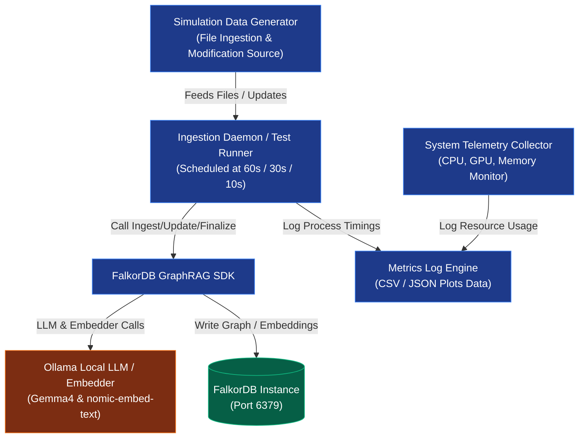

# FalkorDB GraphRAG Bulk Ingestion Bottleneck Experiment: Implementation Plan

This implementation plan outlines the design and development of an experimental framework to analyze the performance bottlenecks of bulk ingestion and knowledge updates in the FalkorDB GraphRAG system at varying frequencies (**1 minute, 30 seconds, 10 seconds**). This plan is designed to support academic-grade PhD research by producing reproducible, logged, and structured telemetry data.

---

## 1. Objectives & Scope
The key objectives of this implementation are:
1. **Remove Zotero Dependency**: Allow ingestion of raw text/PDF documents from any standard local folder.
2. **Support Incremental Updates**: Implement document-updating logic to test how GraphRAG handles knowledge changes (e.g., updating/modifying files).
3. **Capture Telemetry & Metrics**: Log CPU/GPU load, RAM/VRAM usage, database write latency, LLM/Embedder queue status, and pipeline stage execution times.
4. **Automate Scheduled Simulators**: Build a configurable test runner that triggers ingestion loops at 60s, 30s, and 10s intervals.

---

## 2. Experimental Architecture

The experimental framework consists of four primary components:
1. **Simulation Data Generator**: Manages a test corpus directory, feeding new or modified files to the ingestion watch folder.
2. **Ingestion Daemon (Test Runner)**: Polls/receives files and calls the FalkorDB GraphRAG SDK.
3. **System Telemetry Collector**: Captures system-level resource utilization (CPU, RAM, GPU, VRAM) and Docker container states.
4. **Metrics Log Engine**: Stores detailed timings per pipeline phase to CSV or JSON for post-experiment data analysis.



---

## 3. Directory Structure Layout

The project files will be structured as follows:

```
graphrag-falkordb/
├── docs/
│   ├── ingestion_experiment_implementation_plan.md  <-- This Document
│   └── ingestion_experiment_test_plan.md            <-- The Test Plan
├── src/
│   └── ingestion_experiment/
│       ├── __init__.py
│       ├── config.py             # Configs for Ollama, FalkorDB, and intervals
│       ├── file_generator.py     # Generates/modifies files for ingestion
│       ├── monitor.py            # System metrics monitor (CPU, GPU, VRAM)
│       ├── run_experiment.py     # Main scheduler and execution script
│       └── utils.py              # Log formats, math conversions
├── data/
│   ├── raw_dataset/              # Master copies of files to ingest
│   └── test_environment/         # Watch folder during simulation
└── results/
    ├── metrics_60s.csv           # Experiment results output
    ├── metrics_30s.csv
    └── metrics_10s.csv
```

---

## 4. Detailed Component Specifications

### 4.1 Ingestion Daemon & Update Handler (`run_experiment.py`)
This script acts as the core test controller. It instantiates the GraphRAG connection and runs a loop matching the chosen interval ($T \in \{60, 30, 10\}$ seconds).

* **Ingestion Logic**:
  * For completely new files, it uses `rag.ingest(file_paths)`.
  * For modified files (knowledge updates), it uses `rag.update(file_path)` (or `rag.apply_changes(modified=[file_path])`).
* **Finalization Logic**:
  * In standard RAG, `finalize()` must be called to rebuild indices and generate relationship/entity embeddings. 
  * The test runner will support two modes:
    * **Immediate Finalize**: Run `finalize()` immediately after each file ingestion/update.
    * **Batched Finalize**: Run `finalize()` at the end of the entire experiment.
  * Comparing these two modes highlights the overhead of O(graph_size) operations during database updates.

### 4.2 Simulation Data Generator (`file_generator.py`)
To isolate the experiment from external API constraints, this module uses a local folder structure.
* **Add Document**: Copies a text or PDF file from `data/raw_dataset/` to `data/test_environment/`.
* **Update Document**: Edits an existing file in `data/test_environment/` by appending or replacing paragraphs. This triggers a change in `content_hash`, forcing the FalkorDB GraphRAG SDK to process the update (deleting old chunks and updating entities).

### 4.3 System Telemetry Collector (`monitor.py`)
Logs host system utilization to identify hardware bottlenecks:
* **CPU**: Overall utilization percentage and per-core breakdown.
* **RAM**: Total, used, and free system memory.
* **GPU**: VRAM usage and CUDA compute utilization (crucial for local Ollama extraction).
* **FalkorDB / Redis Memory**: Queries FalkorDB memory footprint via `redis-cli INFO memory`.

### 4.4 Metrics Log Engine (`utils.py`)
For every ingestion cycle, the following metrics must be timestamped and saved:
1. **Total Ingestion Duration**: Start to end time of the ingest task.
2. **Stage Durations**:
   - Time spent chunking text.
   - Time spent on LLM Entity/Relation extraction (Step 4).
   - Time spent on FalkorDB Writes (Step 7).
   - Time spent on `finalize()` (Deduplication and Embedding).
3. **Queue Length**: Number of pending files remaining in the queue when the next interval starts (measuring backlog growth).
4. **Success/Error Flag**: Captured exception types (e.g., Timeout, Connection Reset, FalkorDB Lock Error).

---

## 5. Development & Execution Workflow

### Step 1: Set Up Directory Environment
Create folders for raw inputs and active test environments.
```bash
mkdir -p data/raw_dataset data/test_environment results
```

### Step 2: Implement the Experiment Script
Create a python script `src/ingestion_experiment/run_experiment.py` utilizing the SDK.
A simplified code structure for the implementation:

```python
import asyncio
import time
import psutil
from graphrag_sdk import GraphRAG, ConnectionConfig, LiteLLM, LiteLLMEmbedder

async def ingest_cycle(rag, file_path, is_update=False):
    metrics = {}
    start_time = time.time()
    
    try:
        if is_update:
            # Re-sync modified file
            print(f"Updating {file_path}...")
            result = await rag.update(file_path=file_path)
            metrics["chunks_deleted"] = result.chunks_deleted
            metrics["chunks_indexed"] = result.chunks_indexed
            metrics["entities_deleted"] = result.entities_deleted
        else:
            # Ingest new file
            print(f"Ingesting {file_path}...")
            result = await rag.ingest([file_path])
            metrics["nodes_created"] = result.nodes_created
            metrics["relationships_created"] = result.relationships_created
        
        # Track Ingestion Stage
        ingest_end = time.time()
        metrics["ingest_duration"] = ingest_end - start_time
        
        # Track Finalization Stage
        finalize_start = time.time()
        print("Running finalize()...")
        finalize_res = await rag.finalize()
        metrics["finalize_duration"] = time.time() - finalize_start
        metrics["entities_deduplicated"] = finalize_res.entities_deduplicated
        
        metrics["total_duration"] = time.time() - start_time
        metrics["status"] = "SUCCESS"
        
    except Exception as e:
        metrics["total_duration"] = time.time() - start_time
        metrics["status"] = f"ERROR: {type(e).__name__}"
        
    return metrics
```

### Step 3: Integrate System Telemetry
Write system monitor hooks that sample resources at 1-second intervals during the experiment:
```python
def get_system_metrics():
    return {
        "cpu_percent": psutil.cpu_percent(),
        "ram_used_gb": psutil.virtual_memory().used / (1024**3),
        # If GPU is available via GPUtil or subprocess call to nvidia-smi
        "gpu_util": get_gpu_utilization()
    }
```

### Step 4: Run Trials
Execute trials sequentially using a CLI configuration:
```bash
python -m src.ingestion_experiment.run_experiment --interval 60 --duration 1800 --log results/metrics_60s.csv
python -m src.ingestion_experiment.run_experiment --interval 30 --duration 900  --log results/metrics_30s.csv
python -m src.ingestion_experiment.run_experiment --interval 10 --duration 300  --log results/metrics_10s.csv
```

---

## 6. Analysis & Academic Deliverables
The telemetry files generated will be used to analyze:
- **Queue Accumulation**: Cumulative Queue Backlog over time plotted against intervals.
- **Resource Saturation**: Time-series plots of CPU/GPU utilization highlighting bottlenecks (specifically during Ollama extraction).
- **Latency Distribution**: Cumulative Distribution Function (CDF) of ingestion time per file type.
- **Incremental vs Clean Ingestion**: Efficiency ratio of updates versus rebuilding the graph.
